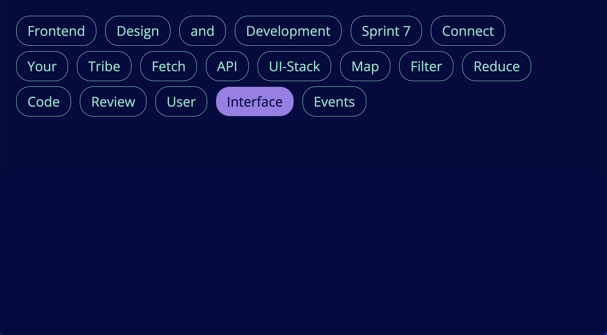

# Tribe UI Events

Dit project omvat een pagina met buttons met daarbij behorende JavaScript events.

## 📚 Inhoudsopgave

* [Beschrijving](#beschrijving)
* [Kenmerken](#kenmerken)
* [Installatie](#installatie)
* [Gebruik](#gebruik)
* [Bronnen](#bronnen)
* [Licentie](#licentie)

## ⚡ Kenmerken
Dit project is gemaakt met HTML, CSS en JavaScript. Verder staat hieronder een korte lijst met gebruikte tools en middelen.

**Tools**

- 🖥️ Webstorm & Visual Studio Code

**Gebruikte technieken**

- 📟 HTML
- ⌚ CSS
- 📲 JavaScript

## 📥 Installatie

1. Clone of download deze respository.
2. Ga naar de root directory van het project.
3. Open het `index.html` bestand, hierdoor wordt de homepagina van de website geopend.

## 🔨 Gebruik

Klik op de verschillende knoppen om deze van kleur te laten veranderen, de knoppen veranderen van kleur bij een enkele click, een dubbele click en als je de knop een tijdje vasthoud.

## 📖 Bronnen
[HTML5](https://www.w3schools.com/html/)
 
[CSS3](https://www.w3schools.com/css/)
 
[JavaScript](https://www.w3schools.com/js/)

## 🔓 Licentie

This work is licensed under [GNU GPLv3](./LICENSE).
